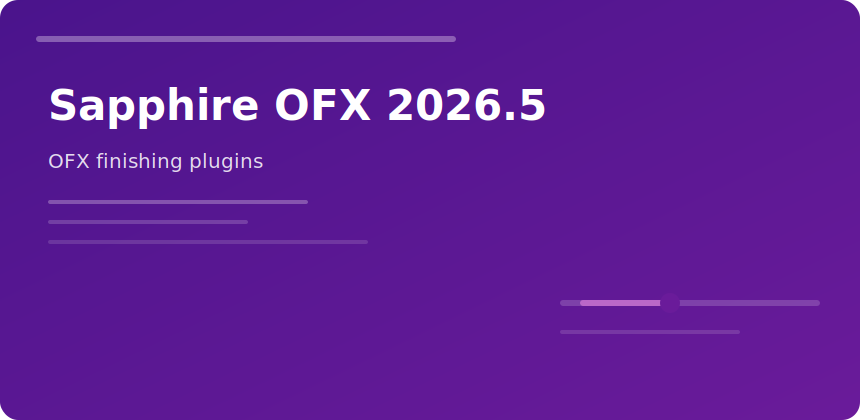

  

  

# Sapphire OFX 2026.5

Same Sapphire math, **OFX packaging** for finishing suites—primarily DaVinci Resolve, with paths for other OFX hosts.

| Host | Typical use |
|------|-------------|
| Resolve Color | Glow, beauty work |
| Resolve Edit | Transition presets |
| Fusion | Composited plates |

### Version alignment

Match 2026.5 builds across AE and OFX licenses in mixed shops to keep preset JSON portable.

### Performance

Enable GPU mode in Boris settings; half-float on high-bit plates reduces banding in Glow.

sapphire ofx 2026 davinci resolve vfx finishing boris fx
